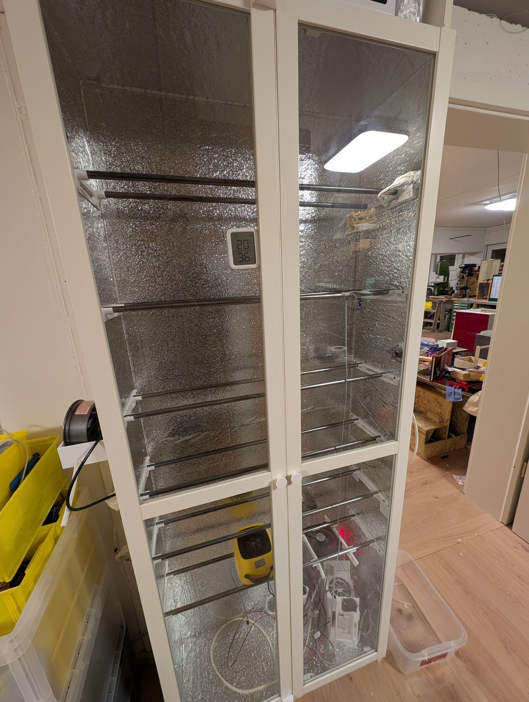
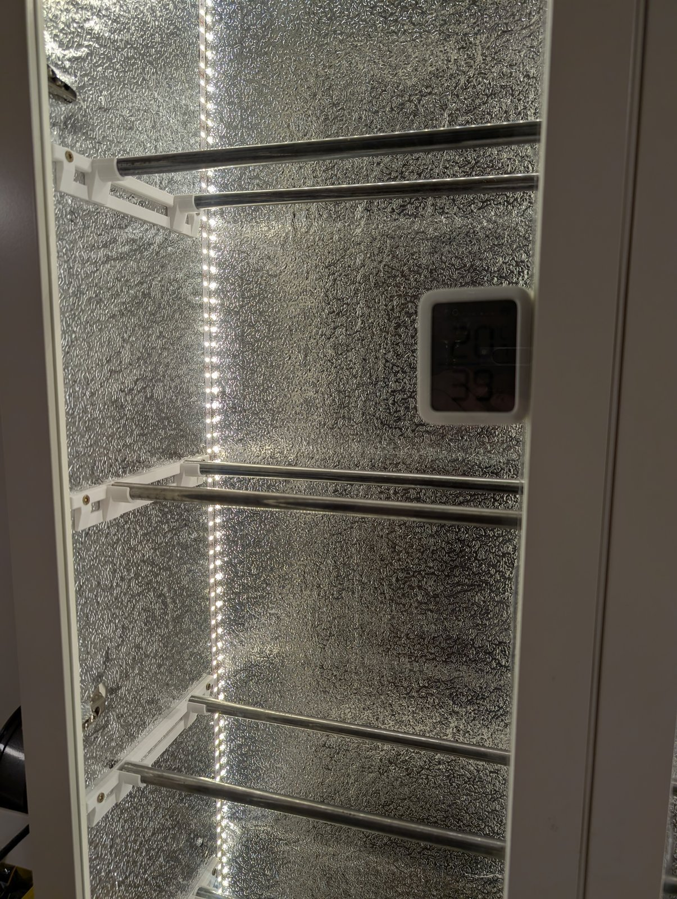
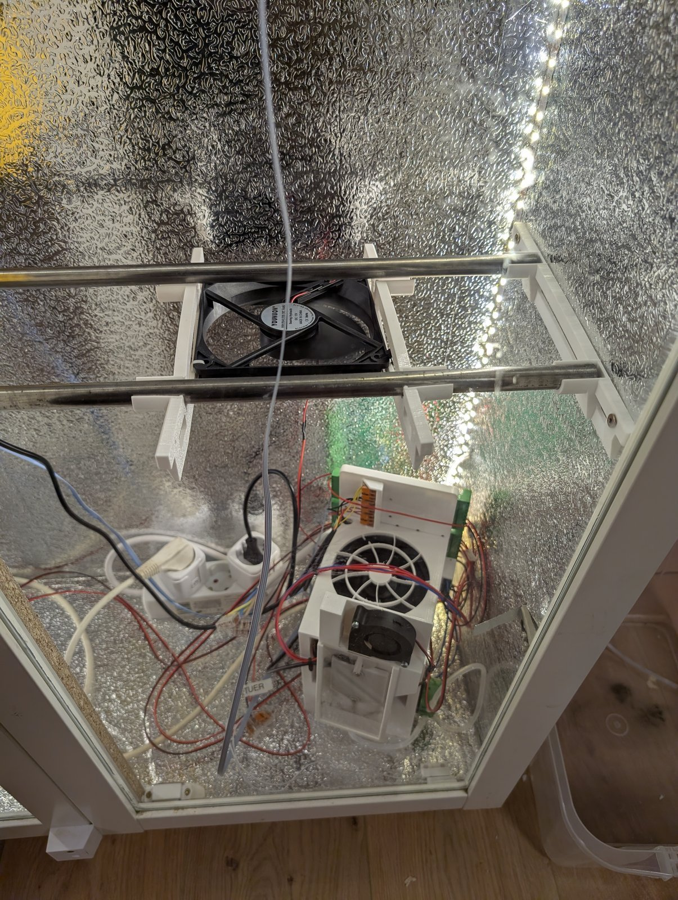
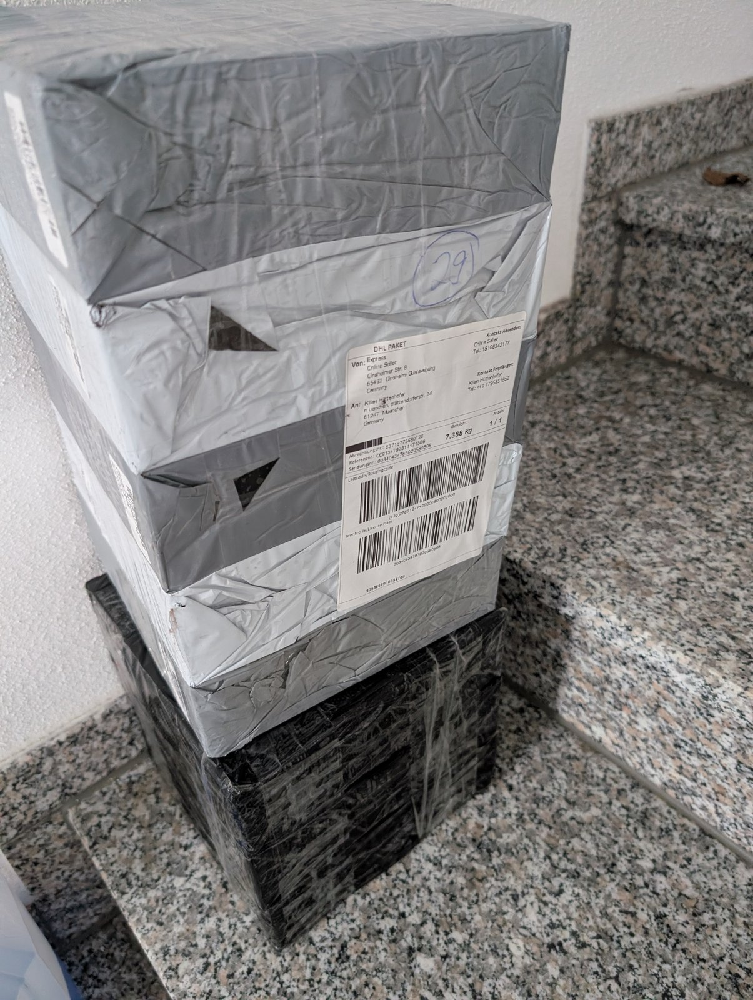
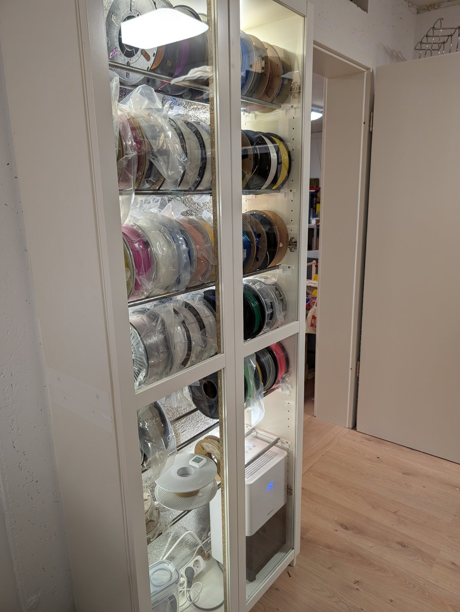
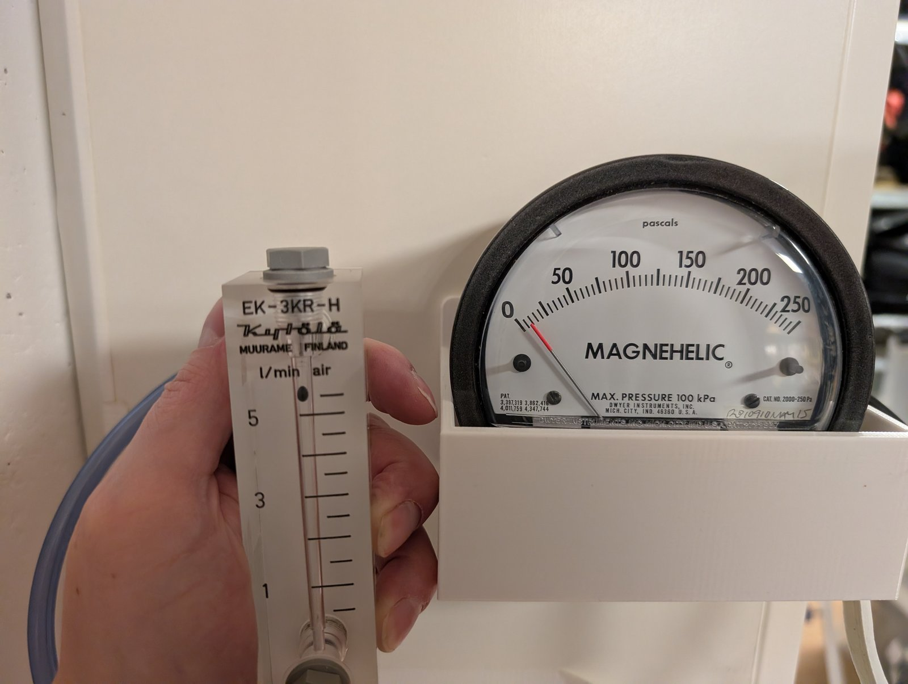

# FilamentDry+Pro


## Features (kurz & knackig)

- Peltier-Entfeuchter (Kälteplatte + Abtau-/Pump-Zyklus)
- Ziel: **<20% rF erreichbar** (bei dichtem Schrank)
- **Aktives Abpumpen** des Tauwassers (Peristaltikpumpe)
- **Auto-Defrost** (vereiste Kaltseite wird abgetaut)
- **ESPHome / Home Assistant** integriert
- Heizmodus für **Batch-Trocknung** (alle Rollen auf einmal)

Ein Filament-Trockenschrank, der darauf optimiert ist, **ein kleines Volumen zuverlässig auf <20% rF** zu bringen – nicht auf maximale Entfeuchtungsleistung in "l/h", sondern darauf, **auch bei sehr trockener Luft weiter sinnvoll zu entfeuchten**.

Das Projekt basiert auf einem IKEA Billy mit Vitrinentüren und einem Entfeuchter-/Kälteplatten-Konzept (Peltier + Abtau-/Pump-Zyklus), gesteuert über ESPHome (ESP32 / KC868-A16) und integriert in Home Assistant.

> Hinweis: Teile der Dokumentation (Druckteile, genaue Konstruktion des Entfeuchters) fehlen noch in der Doku. 

---

## Hardware (BOM light)

- IKEA Billy + passende Vitrinentüren
- XPS (extrudierter Polystyrol-Hartschaum, z.B. Styrodur) + alu-beschichtete Folie (innen abgeklebt)
- TEC/Peltier 40×40 (z.B. TEC1-12706/TEC1-12710)
- Kaltplatte Alu (ca. 50×70×3, bearbeitet)
- Heatsink + 120 mm Fan (oder was du hast) – bei mir ein Set von AliExpress
- Kaltseitengebläse / 5015
- Peristaltikpumpe 12 V
- ESP32 / KC868-A16
- Sensorik: SHT3x (besser SHT45), mehrere DS18B20, LD2412, Türkontakt
- Diverse Druckteile

---

## Warum <20% rF im Schrank nicht "einfach" ist

Unter 20% relativer Luftfeuchte (rF) in einem Schrank zu landen ist deutlich anspruchsvoller, als es zunächst klingt:

- **Alle Ritzen müssen dicht sein.** Ich bin nach meiner Messmethode bei einer effektiven offenen Fläche von **<100 mm²** gelandet (wie ich das genau gemessen habe, beschreibe ich noch ausführlicher).
- Der **Entfeuchter muss extrem kleine Wassermengen** handhaben können (z.B. **pro Lauf <0,5 ml** Kondensat), weil bei sehr trockener Luft schlicht nicht mehr viel Wasser pro Zyklus anfällt.
- Der **Taupunkt** rutscht schnell **unter 0°C** – d.h. der Kältebereich vereist, und man braucht eine durchdachte **Defrost-/Abtau-Strategie**.
- Ziel ist nicht "viel Wasser pro Stunde", sondern **ein kleines, sehr dichtes Volumen auch bei <20% rF weiter zu trocknen**.

---

## Mechanischer Aufbau (Schrank)

- Basis ist ein **IKEA Billy** mit passenden **Vitrinentüren**. Es lässt sich aber entsprechen auf alle Schränke/Vitrinen anwenden. 
- Die Rückwand ist mit **XPS-Hartschaum (extrudierter Polystyrol-Hartschaum, z.B. Styrodur)** gedämmt.
- Innen ist alles mit **alu-beschichteter Dekorfolie** abgeklebt.
Als Filamenthalter werden Stahlstangen und gedruckte Halter verwendet (siehe [Parametric Filament Rack for Cupboards (IKEA Billy)](https://makerworld.com/de/models/59195-parametric-filament-rack-for-cupboards-ikea-billy)).







### Abdichtung der Türen (kritischster Punkt)

Die Türen sind mit einer **D-Dichtung** abgedichtet. Das ist die kritischste Stelle – Sorgfalt ist hier besonders wichtig:

- Jedes kleine Loch zieht unnötig viel feuchte Luft nach.
- Ich habe zusätzliche Teile gedruckt, um **zwischen den Türen** eine Dichtung anzubringen.
- Mit einer Dichtung als Anschlag auf der anderen Tür hatte ich **keinen zufriedenstellenden Erfolg**.

---


## Zusätzlich: Heizer für "alles auf einmal troknen wenn es feucht ist"

Zusätzlich ist ein **Heizer** vorgesehen, um sehr einfach **alle Filamente (ca. 60 Rollen) auf einmal zu trocknen**.
So wird billiges oder altes Filament plötzlich wieder problemlos druckbar. Oder wenn du es bisher mit der lagerung nicht so genau genommen hast, kannst du alles auf einmal troknen.



Du kannst Billiges Filament kaufen wie dieses und es Druckt hervorragend.

---

## Exkurs: Warum ein Standard-Entfeuchter mich erstmal in die Irre geführt hat

Zuerst habe ich – ohne groß nachzudenken – einen Entfeuchter genommen, den ich noch über hatte.
„Der schafft laut Datenblatt ordentlich was, der muss doch meinen Schrank problemlos entfeuchten…“

Leider falsch.

Er hat es zwar scheinbar geschafft, die Anzeige in Richtung "trockener" zu bewegen – aber im Nachhinein war klar: Das war hauptsächlich, weil das Gerät mit seiner Leistungsaufnahme von ca. **200 W** den Schrank stark aufgeheizt hat (bei mir bis ca. **45°C**).
Im Tank vom Entfeuchter war aber **nie Kondensat**.

Daraufhin habe ich mal nachgedacht und gerechnet: Es klappt so einfach nicht.
Das Wasser im Schrank ist einfach zu wenig (siehe die Beispielrechnung oben – wir reden hier über Größenordnungen von **<1 ml** bei typischen rF-Änderungen).



---

## Warum eine aktive Pumpe (Tauwassermanagement)

Ich habe mich für eine **aktive Pumpe** zum Abpumpen des Tauwassers entschieden.
Der Grund ist simpel: Bei einem relativ kleinen Innenvolumen fällt bei einer typischen Absenkung der Luftfeuchte nur extrem wenig Wasser an – und **jeder Tropfen zählt**.

### Innenvolumen (Billy / Schrank)

Ausgehend von ca. $76 \cdot 28 \cdot 190\,cm^3$:

$$V = 76\,cm \cdot 28\,cm \cdot 190\,cm = 404{.}320\,cm^3 = 0{,}40432\,m^3$$

### Wie viel Wasser steckt in der Luft? (30% → 20% rF bei 20°C)

Näherung über die absolute Feuchte bei 20°C:

- Sättigungs-Feuchte bei 20°C: ca. $\rho_{v,\,sat} \approx 17{,}3\,g/m^3$
- Bei 30% rF: $\rho_{v,30} \approx 0{,}30 \cdot 17{,}3 \approx 5{,}19\,g/m^3$
- Bei 20% rF: $\rho_{v,20} \approx 0{,}20 \cdot 17{,}3 \approx 3{,}46\,g/m^3$

Differenz:

$$\Delta \rho_v \approx 5{,}19 - 3{,}46 = 1{,}73\,g/m^3$$

Wassermenge im Schrankvolumen:

$$\Delta m \approx \Delta \rho_v \cdot V \approx 1{,}73\,\frac{g}{m^3} \cdot 0{,}40432\,m^3 \approx 0{,}70\,g$$

Das sind grob:

$$0{,}70\,g \approx 0{,}70\,ml$$

Also: Bei so einer „normalen“ Absenkung steckt im gesamten Schrank nur **deutlich unter 1 ml** Wasser in der Luft.

### Konsequenz

Wenn ich dieses Wasser einfach an Oberflächen hängen lasse, verdunstet es sofort wieder – und ich habe nichts gewonnen.
Darum saugt eine **Peristaltikpumpe** das Kondensat ab und fördert es über einen Schlauch nach außen.
Damit ist auch die Höhe egal, und das Wasser kann draußen gesammelt werden.

Außerdem habe ich auch alle Oberflächen die mit Wasser bis zum Schlauch in berührung kommen mit einem Regenabweiser für Windschutzscheiben behandelt. Gerade bei den Druckteilen ein riesen unterschied.


---

## Dichtigkeit messen (Leckfläche)



Ich messe die Dichtigkeit über:

- einen **Durchflussmesser** (max. 5 l/min)
- den **Differenzdruck** zwischen innen und außen

Über Durchfluss und Differenzdruck kann ich auf die **äquivalente offene Fläche** schließen.

Wichtig: Mein Differenzdruck-Messgerät hat einen **Offset von gut ~5 Pa**. Für die Rechnungen ist das vor allem dann relevant, wenn man nahe an diesem Bereich misst (dann muss man den Offset entsprechend berücksichtigen).

### Formel

Als Näherung (Orifice-/Düsenmodell) kann man verwenden:

$$Q = C_d \cdot A \cdot \sqrt{\frac{2\,\Delta p}{\rho}}$$

- $Q$ = Volumenstrom [$m^3/s$]
- $A$ = äquivalente Leckfläche [$m^2$]
- $\Delta p$ = Differenzdruck [Pa]
- $\rho$ = Dichte von Luft (typisch ca. $1{,}2\,kg/m^3$)
- $C_d$ = Abflussbeiwert (typisch grob $0{,}6$ als Näherung)

Umgestellt nach $A$:

$$A = \frac{Q}{C_d \cdot \sqrt{\frac{2\,\Delta p}{\rho}}}$$

### Beispielrechnung (15 l/min bei 10 Pa)

- $Q = 15\,l/min = 0{,}015\,m^3/min \approx 0{,}00025\,m^3/s$
- $\Delta p = 10\,Pa$
- $\rho \approx 1{,}2\,kg/m^3$
- $C_d \approx 0{,}6$

$$\sqrt{\frac{2\,\Delta p}{\rho}} = \sqrt{\frac{20}{1{,}2}} \approx 4{,}08$$

$$A \approx \frac{0{,}00025}{0{,}6 \cdot 4{,}08} \approx 1{,}02\cdot10^{-4}\,m^2 \approx 102\,mm^2$$

### Messwerte (5 l/min bei 10 Pa) + äquivalenter Bohrdurchmesser

- $Q = 5\,l/min = 0{,}005\,m^3/min \approx 8{,}33\cdot10^{-5}\,m^3/s$
- $\Delta p = 10\,Pa$
- $\rho \approx 1{,}2\,kg/m^3$
- $C_d \approx 0{,}6$

$$\sqrt{\frac{2\,\Delta p}{\rho}} = \sqrt{\frac{20}{1{,}2}} \approx 4{,}08$$

$$A \approx \frac{8{,}33\cdot10^{-5}}{0{,}6 \cdot 4{,}08} \approx 3{,}40\cdot10^{-5}\,m^2 \approx 34\,mm^2$$

Um das greifbarer zu machen, kann man die Leckfläche als „Bohrung“ interpretieren:

$$A = \frac{\pi d^2}{4} \;\;\Rightarrow\;\; d = \sqrt{\frac{4A}{\pi}}$$

Mit $A \approx 34\,mm^2$:

$$d \approx \sqrt{\frac{4\cdot 34}{\pi}}\,mm \approx 6{,}6\,mm$$

### Zusammenhang (Intuition)

- Bei gleicher Leckgeometrie gilt grob: $Q \propto A \cdot \sqrt{\Delta p}$.
- Heißt: doppelte Leckfläche → ungefähr doppelter Durchfluss; vierfacher Druck → ungefähr doppelter Durchfluss.
- In der Praxis ist $C_d$ nicht exakt bekannt und die Strömung kann komplex sein – als Vergleichs-/Debug-Tool funktioniert es aber sehr gut.

### Was ich damit herausgefunden habe

- **Glasscheiben in den Rahmen sind undicht** → unbedingt mit **Silikon** abdichten.
- **Tape außen am Schrank** hilft quasi nicht → besser **innen abkleben** oder **silikonisieren**.

---

## Elektronik & Steuerung (ESPHome / Home Assistant)

Die Steuerung läuft auf einem **ESP32** (Board: `esp32dev`) und ist als **ESPHome-Node** in Home Assistant eingebunden (API mit Encryption).

### Sensorik

- **SHT3x** am I²C (Temp + rF)
- **Absolute Feuchte** als berechneter Sensor
- **DS18B20** am 1‑Wire Bus (u.a. Kaltplatte + Heißseite)
- **LD2412 Radar** über UART (Präsenz, Telemetrie)
- **Türkontakt** über PCF8574 Input

### Aktoren

- Peltier-Leistungsstufe (Enable/slow PWM)
- Lüfter Kaltseite (slow PWM)
- Lüfter Heißseite (GPIO/PCF8574)
- Peristaltikpumpe (GPIO/PCF8574)
- Innenlicht (GPIO/PCF8574)
- Zusatzlüfter (GPIO/PCF8574)

### Logik: State Machine

Die Entfeuchtung läuft als State Machine mit den Zuständen:

- `IDLE`
- `COOLING`
- `DEFROST`
- `PUMP`

Wichtige Punkte:

- Start/Stop über relative Feuchte (`rh_start` / `rh_stop`)
- Solltemperatur der Kaltplatte (`t_cold_soll`) mit einfacher Regelung
- Defrost-Ende über Kaltplatten-Temperatur (`t_defrost_end`) und zusätzlich:
  - Max. Cooling-Dauer (`t_cool_max`)
  - Eis-Heuristik über Temperaturabweichung (`delta_t_ice`, `t_ice_min`)
- Pumpdauer im Pump-State (`t_pump`)
- Übertemperatur-Schutz Heißseite (`t_hot_max`) → Fault (gelatcht)
- Türlogik: State Machine läuft weiter, aber bei offener Tür wird **nur** der Zusatzlüfter sofort aus gemacht
- Auto-Licht: Radar/Tür + Hold-Timer (`t_light_hold`)

### Home Assistant Entities

ESPHome erzeugt die Entities automatisch; die Entity-IDs sind dabei in der Regel nach dem Muster:

- `domain.<node>_<name>`

Also z.B. (bei `devicename: filament-dryer`):

- `switch.filament_dryer_peltier_enable`
- `number.filament_dryer_t_pump`
- `sensor.filament_dryer_rh`

Wenn du stattdessen unbedingt `number.t_pump_<devicename>` (Gerätename hinten) willst, ist das in ESPHome nicht sauber erzwingbar – das macht man am zuverlässigsten über die **Entity Registry** in Home Assistant.

---

## Konfiguration / Inbetriebnahme

- ESPHome (z.B. als Home-Assistant Add-on) installieren
- `filamentdrypro.yaml` als Node-Konfiguration verwenden
- `secrets.yaml` anlegen (wird per `.gitignore` ausgeschlossen)

Beispiel-Struktur (Platzhalter):

```yaml
wifi_ssid: "..."
wifi_password: "..."
esp_password: "..."
api_key: "..."  # ESPHome API encryption key
ota_password: "..."
```

Wichtige Stellen in der YAML:

- `substitutions.devicename` / `friendly_name`
- DS18B20 `address` (Kalt/Heißseite) an deine Sensoren anpassen
- Pin-/I²C-/PCF8574-Addresses entsprechen dem KC868-A16 Setup

---

## Bilder für GitHub optimieren

Im Ordner `images/` liegen Fotos für die Doku. Damit keine EXIF-/Text-Metadaten (z.B. GPS/Device-Infos) im Repo landen und die Bilder für GitHub-READMEs eine sinnvolle Größe haben, gibt es ein kleines Tool:

Installation:

```bash
pip install -r tools/requirements.txt
```

Beispiele (Windows/PowerShell):

```bash
python tools/optimize_images.py images --dry-run
python tools/optimize_images.py images --max-size 1600
```

Wenn `python` nicht gefunden wird:

```bash
py tools/optimize_images.py images --dry-run
```

---

## Danksagung / Meta

Ein Teil der YAML-Aufräumarbeiten (Entity-Definitionen, IDs, Validierung) und das Rundschleifen dieser README wurde von **GitHub Copilot (GPT-5.2)** unterstützt.

---

## Sicherheit

Achtung: Je nach Netzteil/Heizer/Peripherie sind hier Ströme/Spannungen im Spiel, die gefährlich sein können. Elektrik nur fachgerecht ausführen und absichern.

---

## TODO

- Kaltlüfter regeln, um maximale Entfeuchtung oder sanftes Halten zu ermöglichen
- Taupunkt berechnen, um die Kaltseite entsprechend einzustellen
- Wenn die Kaltseite nicht unter 0°C kommt: regelmäßiges Abpumpen
